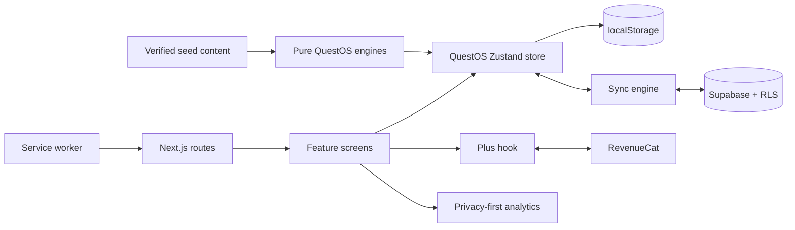

# BibleQuest codebase guide

This guide is the quickest way to understand where behavior lives and which
files should change together. It complements the product specification in
[`BIBLEQUEST_CODEX.md`](BIBLEQUEST_CODEX.md); that document defines the product,
while this one explains the implementation.

## Mental model

BibleQuest is a local-first Next.js application. The interface reads from one
persisted QuestOS store, so the full daily loop works without an account or a
network connection. Supabase adds optional authentication and cross-device
sync. RevenueCat adds optional Plus entitlement state. Neither service replaces
the local store as the UI's immediate source of truth.



## Directory map

| Path | Responsibility |
| --- | --- |
| `src/app/` | Next.js App Router entry points, layouts, metadata, and route handlers. Route files should stay thin and delegate UI to components. |
| `src/app/(marketing)/` | Public website pages such as home, about, pricing, churches, privacy, and terms. |
| `src/app/app/` | Private/installable application routes: home, quests, Bible, prayer, reflection, journey, account, Plus, and settings. |
| `src/components/app-shell/` | Private-app frame, navigation, hydration fallbacks, theme/language application, service-worker registration, and account sync lifecycle. |
| `src/components/design-system/` | Reusable BibleQuest primitives, icons, paper surfaces, motion affordances, pixel assets, and feedback UI. |
| `src/components/<feature>/` | Feature screens and controls. These translate user intent into QuestOS actions; they should not duplicate domain rules. |
| `src/lib/questos/` | Domain types, pure decision engines, persistence, migrations, and the central local-first store. |
| `src/lib/sync/` | Supabase row mapping, pull/merge/push coordination, deletion tombstones, and sync status. |
| `src/lib/supabase/` | Browser/server clients, auth-session middleware, and the client session hook. |
| `src/lib/revenuecat/` | Deny-by-default billing configuration, identity-safe SDK access, pure entitlement modeling, and the React Plus hook. |
| `src/lib/analytics/` | Explicit-consent analytics schema, sanitization, offline queue, and transport. |
| `src/lib/bible/` | Bible metadata and server-only chapter loading. |
| `src/lib/i18n/` | English source strings, locale dictionaries, language metadata, and typed lookup helpers. |
| `src/lib/utils/` | Small dependency-free helpers for dates, names, Scripture, avatars, class names, and hydration. |
| `src/data/seed/` | Reviewed quests, milestones, prompts, and daily verses. Treat this as product content, not arbitrary fixtures. |
| `src/data/bible/` | Public-domain World English Bible JSON, loaded on the server. |
| `supabase/` | Local Supabase configuration, ordered migrations, seed SQL, and policy evidence. |
| `public/` | PWA icons, brand files, tree sprites, and the production service worker. |
| `tests/` | Domain, sync, analytics, billing, security-header, service-worker, import/export, and asset tests. |
| `scripts/` | Deterministic import/build utilities for Bible data, seed data, Supabase seed SQL, and icons. |
| `docs/` | Product, setup, security, deployment, content, QA, analytics, and billing runbooks. |

## Request and rendering flow

1. `src/app/layout.tsx` installs global fonts, metadata, styles, and the service
   worker registrar.
2. Public routes render through `src/app/(marketing)/layout.tsx`.
3. Private routes render through `src/app/app/layout.tsx`, which composes:
   `OnboardingGate` → theme/sync providers → `AppShell` → feature route.
4. Feature route files load server data when needed, then render a component
   from `src/components/`.
5. Client screens select stable state slices from `useQuestOS` and call store
   actions. Complex derived arrays or objects belong in `useMemo`, not Zustand
   selectors, because selectors must keep stable references.
6. The store persists under `biblequest:v1`. Its versioned migrations in
   `src/lib/questos/store.ts` preserve older on-device journeys.

## Core subsystems

### QuestOS domain and store

- `types.ts` defines persisted domain shapes. Changing a persisted shape may
  require a store migration, import-schema update, sync mapping update, and
  tests.
- `store.ts` owns all user mutations and local persistence. Prayer and
  reflection bodies must never be sent to analytics or logs.
- `quest-engine.ts` filters and deterministically suggests quests.
- `quest-feed.ts` groups the persistent quest shelf for display.
- `journal.ts` derives the mixed, date-grouped Prayer Journal timeline and
  performs in-memory search/filtering without persisting a search index.
- `journal-drafts.ts` keeps scoped, expiring unfinished prayer/reflection
  drafts in device-local browser storage. Drafts never enter account sync.
- `quest-steps.ts` defines the four-part quest walk.
- `growth-engine.ts`, `streak-engine.ts`, and `milestone-engine.ts` derive
  journey progress without UI dependencies.
- `verse-engine.ts` chooses the daily verse deterministically, including the
  same-day “Another verse” offset.
- `seasonal-engine.ts` derives the current liturgical atmosphere.
- `snapshot.ts` and `import-schema.ts` provide the export/import boundary.

Store actions are the write boundary. Components should not mutate persisted
objects or reproduce rules such as daily pick limits, streak rollover, milestone
awards, or tombstone creation.

### Optional account sync

`src/components/app-shell/SyncManager.tsx` starts and stops the singleton sync
engine as the Supabase user changes. `src/lib/sync/engine.ts` performs an initial
pull → merge → local apply → remote push, then subscribes to local changes for
debounced write-through updates.

Important safeguards:

- A device journey previously owned by another account blocks sync until the
  user chooses whether to clear or claim it.
- Local deletions create tombstones so a later pull cannot resurrect them.
- Prayer and reflection rows are protected by Supabase RLS.
- A failed initial pull never falls through to a blind push.
- Account purge and restore operations rebuild the remote copy deliberately.

`mapping.ts` is the only translation layer between QuestOS objects and database
rows. Keep conversions symmetric and update both directions together.

### Authentication

- `src/proxy.ts` delegates cookie refresh to
  `src/lib/supabase/middleware.ts`.
- `src/lib/supabase/client.ts` creates the browser client only when public
  configuration exists.
- `src/lib/supabase/server.ts` creates cookie-aware server clients.
- `src/lib/supabase/useSession.ts` exposes client auth state and deduplicates the
  sign-in completion event across mounted consumers and tabs.
- `src/app/auth/callback/route.ts` validates redirects before completing auth.

The service-role key is never valid in browser code. Ownership is enforced in
the database, not by trusting client filters.

### Plus and billing

- `config.ts` validates the explicit billing mode and its matching public key.
- `client.ts` serializes SDK configuration, account transitions, and customer
  operations to prevent entitlement leakage during account switches.
- `model.ts` converts provider responses into provider-neutral Plus state.
- `usePlus.ts` binds that state to the active Supabase identity and ignores
  stale async results.
- Plus components consume the hook; they do not call the SDK directly.

Billing is deny-by-default. A key by itself does not enable checkout, and the
free faith experience must remain complete when billing is unavailable.

### Analytics and privacy

`src/lib/analytics/events.ts` is the sole analytics entry point. Events require
valid public configuration, explicit stored consent, no browser privacy signal,
and a schema-approved event/property set. URLs are reduced to safe route shapes,
offline events use a capped queue, and consent withdrawal clears or cancels
pending work.

Never add prayer text, reflection text, names, email addresses, Scripture text,
free-form search terms, record IDs, or arbitrary URLs to analytics.

### PWA and offline behavior

`public/sw.js` precaches a small public shell and uses network-first navigation
for an explicit allowlist of safe app routes. Immutable build assets use
stale-while-revalidate. Auth, account, billing, API, cookie-bearing, private, and
query-bearing responses are excluded from caching.

When the worker policy changes, increment `CACHE_VERSION` and update
`tests/service-worker.test.ts` in the same change.

## Route map

| Route family | Screen or purpose |
| --- | --- |
| `/` and marketing pages | Public acquisition and policy pages. |
| `/onboarding` | First-run profile and rhythm setup; prioritizes an account immediately before the first-quest reveal while preserving a quiet local-only path. |
| `/app` | Daily home: verse, quests, candle, growth, and next steps. |
| `/app/quests` | Browse, filter, and pick quests. |
| `/app/quests/[slug]` | Read, start, walk, complete, save, or archive one quest. |
| `/app/bible` | Bible index and reading progress. |
| `/app/bible/[book]/[chapter]` | Server-loaded WEB chapter reader. |
| `/app/bible/saved` | Saved verse bookmarks. |
| `/app/prayer`, `/app/prayer/reflections`, and `/app/prayer/new` | Unified, date-grouped Prayer Journal with local search, filters, privacy screen, prompts, and the prayer composer. The reflections URL opens the same journal prefiltered. |
| `/app/prayer/reflection/new` | Focused reflection composer with prompts, mood, safe plain-text formatting, and device draft recovery. |
| `/app/reflection` and `/new` | Legacy redirects retained for bookmarks and older app links. |
| `/app/journey` | Growth tree, milestones, and journey history. |
| `/app/account` | Optional sign-in, identity, and sync controls. |
| `/app/plus` | Plus status, purchase, and customer-management entry points. |
| `/app/settings` | Preferences, language, accessibility, consent, export/import, and reset. |
| `/offline` | Honest fallback when a safe cached route is unavailable. |
| `/api/health` | Minimal deployment health response. |
| `/auth/callback` | Supabase auth completion with redirect validation. |

## Change recipes

### Add or change persisted data

1. Update `src/lib/questos/types.ts`.
2. Update the initial state and actions in `store.ts`.
3. Bump the persistence version and add a migration when older devices need a
   default or shape conversion.
4. Update snapshot/import validation.
5. Update sync rows, mappings, migrations, grants, and RLS when the field syncs.
6. Add store, import/export, and sync tests.

### Add a quest or content field

1. Follow `docs/CONTENT_GUIDE.md`.
2. Update the typed seed model and generator if the shape changes.
3. Rebuild mirrored Supabase seed data.
4. Verify exact public-domain Scripture text and adversarial content review.

### Add a screen

1. Keep the route file thin.
2. Reuse design-system and shell primitives.
3. Put business rules in a pure engine or store action.
4. Add the route to navigation only when it belongs in the primary loop.
5. Review offline-cache eligibility explicitly; do not assume every private
   route is safe to cache.

### Add analytics

1. Add a typed event to `AnalyticsEventProps`.
2. Add the matching runtime rule to `EVENT_RULES`.
3. Use only bounded enums or bounded numbers.
4. Add sanitizer and consent tests before calling `track` from a feature.

## Verification

Run the smallest relevant test while editing, then the full gate before merge:

```bash
pnpm lint
pnpm test
pnpm build
```

Security, billing, sync, service-worker, or schema changes also require the
targeted checklists in `docs/QA.md`, `docs/REVENUECAT.md`, and
`docs/SUPABASE_SECURITY_ROLLOUT.md`.

## Comment style

Comments should explain intent, invariants, privacy/security boundaries, race
avoidance, or non-obvious product rules. Avoid comments that merely translate a
function name or repeat JSX. When code can be made self-explanatory with a good
name or a small extraction, prefer that over a longer comment.
